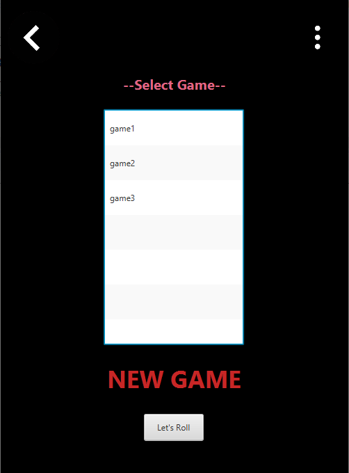

# Color-Switch-2.0
A replica of original Color Switch game, implemented via JavaFX and various concepts of Object Oriented Programming.

# Compilation !
- Clone the repository
- Open /src folder in Terminal/CMD
- execute: 'java App.java'
- Or open /bin folder in Termincal/CMD
- exceute: 'java App'

# How to Play !
- Enter as new player
- Use 'spacebar' to jump & move the ball
- Collect stars, Increase score
- Have Fun!

# ScreenShots

